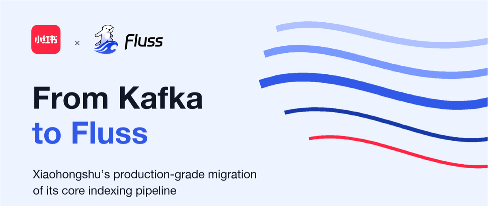
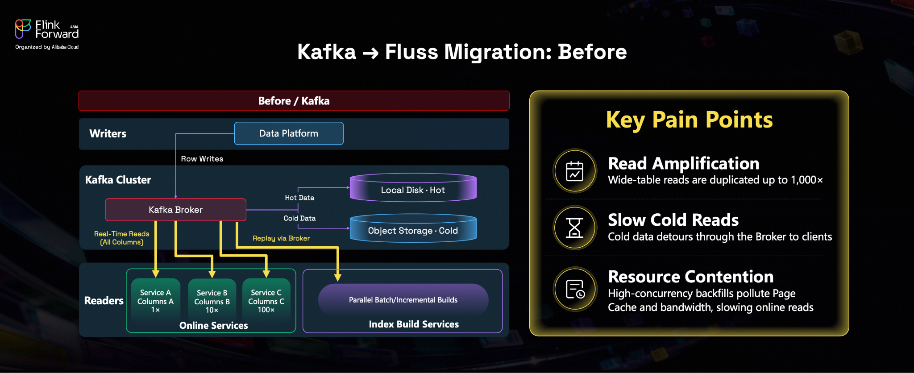
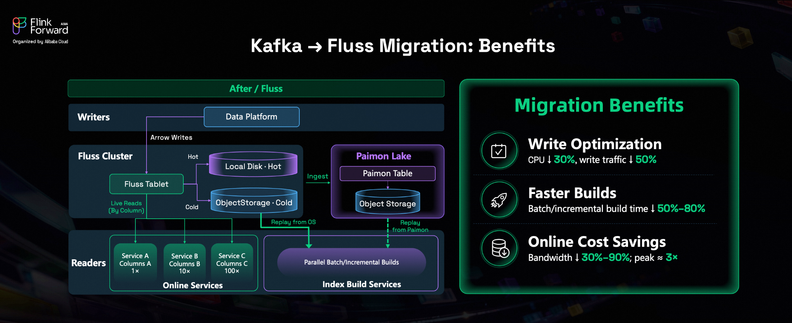
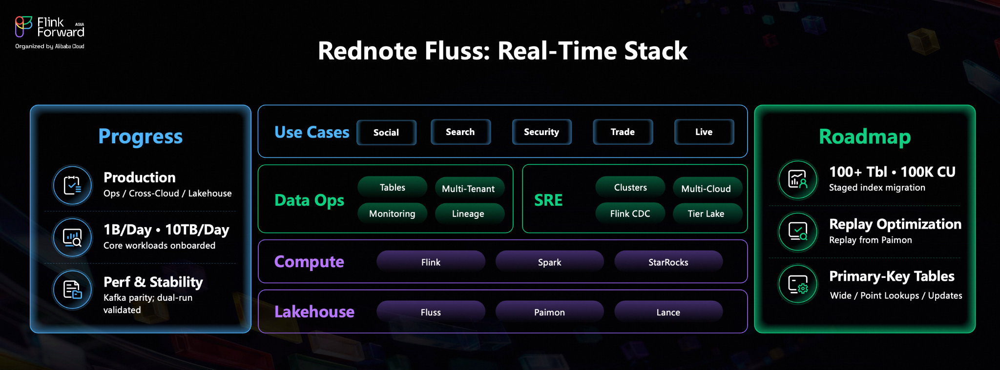

*A production case study in columnar streaming, cold-data isolation, and lakehouse integration*
*Presented at Flink Forward Asia 2026.*

[Rednote](http://rednote.com/) (Xiaohongshu) is a lifestyle community platform centered on content discovery and sharing. During the FIFA World Cup, it becomes a hub for live coverage, pre-match analysis, trending posts, and fan discussions.

At that scale, hundreds of millions of users can hit live streaming, search, and feeds at once. Content must refresh in moments while advertising, search, and recommendation services stay stable—powered by a real-time indexing pipeline that continuously ingests data and updates indexes.

That pipeline is critical to Rednote's content distribution and user experience, but its Kafka-based wide-table architecture was reaching cost and stability limits. To scale without compromising real-time performance, Rednote introduced **Fluss** into its core production path and began progressively migrating index data from Kafka to Fluss.

<!-- truncate -->

## Why the indexing pipeline needed to change

Rednote's search, recommendation, and advertising systems all depend on real-time indexes. Upstream processing platforms continuously produce wide tables, while many downstream online services consume different subsets of those tables. One service may need content features, another may care about user and interaction fields, and a third may build a specialized index for search or ads. The consumers are numerous, their column requirements differ, and their fan-out ratios vary dramatically.

Kafka remains a mature and dependable messaging platform. But in this particular workload, row-oriented writes and full-row consumption amplified three structural problems.

*Figure 1. Before the migration: Kafka wide-table distribution created read amplification, slow cold reads, and resource contention.*

### 1. Read amplification kept growing

The same wide table was consumed repeatedly by multiple online services, even though each service needed only a fraction of the available columns. In a row-oriented model, a consumer interested in a handful of fields still had to read and process the entire record.

As fan-out increased from 1x to 10x and 100x—and reached roughly 1,000x in some localized workloads—large volumes of irrelevant data were repeatedly transferred across the network. At Rednote's scale, that unnecessary I/O translated directly into bandwidth and compute costs.

### 2. Cold-data replay took the long way around

Index building does not consume only the latest events. Batch and incremental jobs frequently need to scan historical data as well. In the previous architecture, cold data lived in object storage. A replay first had to pull that data back through a Kafka broker, which then forwarded it to the client.

That extra hop lengthened the path and forced brokers designed for real-time delivery to carry substantial historical scan traffic.

### 3. Historical scans competed with online traffic

Batch and incremental index builds often scan historical data with high concurrency. Those reads consumed broker network bandwidth and polluted the page cache, creating direct contention with latency-sensitive online consumers.

For a core indexing pipeline, online stability comes first. If a historical rebuild can degrade real-time delivery, the architecture needs a cleaner boundary between hot-path consumption and cold-data access.

The real issue was not simply a need to replace one messaging system with another. The organization and access pattern of the data no longer matched the way the data was being consumed. Rednote needed a platform that preserved streaming semantics while adding columnar reads, hot-and-cold tiering, and native integration with lake storage.

## What changed with Fluss

The migration changed how data was written, consumed, and replayed.

*Figure 2. After the migration: columnar consumption, direct object-store reads, and Paimon integration reshape the real-time indexing path.*

### Online services moved from full-row transfers to columnar reads

Upstream systems write to Fluss through Apache Arrow. Downstream services can then read only the columns they actually need instead of fetching the full row every time.

Consumption cost is therefore tied more closely to the data a service uses, rather than to the total width of the source table. In a pipeline with wide records, many consumers, and high fan-out, the value of column projection compounds as the workload grows.

### Historical replay bypassed the broker

Cold-data replay no longer has to flow entirely through the broker path. Index builders can read Fluss log files directly from object storage, separating large historical scans from the online messaging layer.

This reduces pressure on broker NICs and cache resources. Real-time consumers stay on a low-latency path, while historical builds use a route better suited to parallel scans. The result is stronger isolation between two workloads with very different performance profiles.

### Fluss and Paimon created a shared Lakestream foundation

Rednote also uses Fluss's Lakestream to write the same real-time data into Apache Paimon. During migration, the Paimon tables support data exploration and dual-run validation, helping the team compare the new and existing pipelines for correctness. In production, the lake copy can also serve historical replay, offline analytics, and batch index construction.

Instead of maintaining separate and disconnected real-time and historical datasets, the architecture moves toward a common data foundation that can serve both.

## The gains appeared across the entire pipeline

Because the migration changed data layout, access paths, and workload isolation at the same time, the benefits were not confined to a single benchmark.

**On the write path, CPU usage fell by about 30%, while write traffic fell by roughly 50%.** Arrow-based writes and a layout better suited to the indexing workload reduced resource consumption and created more stability headroom for traffic peaks.

**For index construction, batch and incremental build times fell by roughly 50% to 80%.** Builders could pull data in parallel more efficiently, allowing changes in the business to propagate faster into search, recommendation, and advertising indexes.

**Across online workloads, bandwidth savings ranged from about 30% to 90%, while peak throughput increased by approximately 3x.** Columnar reads eliminated large amounts of unnecessary data transfer, particularly for wide tables with many downstream consumers.

The significance lies in the combination. The core pipeline gained lower resource overhead, faster index builds, and greater peak capacity at the same time. Together, those improvements create the operating margin a production system needs in order to keep scaling.

## The hardest part was proving production readiness

Clear performance gains did not make the migration simple. For infrastructure at Rednote's scale, a new system must answer more than whether its features work. It must demonstrate predictable performance, long-running stability, data correctness, and operational maturity.

The team therefore treated Fluss as production infrastructure from the outset, not as an experimental swap. It ran comprehensive load tests against the critical Kafka baselines, followed by extended dual-run validation to confirm data correctness. Only after the new path had passed those checks did the team progressively connect core workloads and expose it to real production traffic.

Platform capabilities had to mature alongside the data path: table management, multi-tenancy, monitoring and alerting, data lineage, cluster operations, multi-cloud control, cross-region backup, and lake-ingestion job management. These capabilities are less visible than a throughput chart, but they determine whether a system can move from a successful test to years of reliable operation.

## From one critical pipeline to a shared real-time data platform

Fluss is now running in Rednote's core production indexing path. According to the figures shared in the talk, a single table is already ingesting roughly 1 billion records and 10 TB per day, and the deployment has completed performance and stability validation.

In the second half of 2026, Rednote plans to continue the progressive migration of existing Kafka-based index pipelines. The next phase is expected to span more than 100 tables and infrastructure measured in hundreds of thousands of CPU cores. The rollout will remain phased and controlled, allowing the old and new paths to hand off traffic gradually rather than through a high-risk cutover.

For historical replay, the team plans to make greater use of Paimon's column projection and the unified streaming-and-lakehouse architecture to improve object-storage efficiency. For real-time serving, it will also explore Fluss primary-key tables for enrichment, point lookups, partial updates, and continuously updated state.

*Figure 3. Rednote's Fluss real-time data platform: current progress, platform capabilities, ecosystem integration, and future plans.*

That roadmap changes the role Fluss plays inside Rednote. It is no longer merely an alternative transport layer; it is evolving into a more unified real-time data service. Over time, the platform is expected to integrate more deeply with compute engines such as Flink, Spark, and StarRocks, and with lake technologies including Paimon and Lance, supporting workloads across the community, search and recommendation, advertising, security, commerce, and live streaming.

## The takeaway: this was bigger than a broker swap

Rednote's move from Kafka to Fluss was not a rejection of a mature technology, nor was it a component change made for a single headline benchmark. It addressed a connected set of scaling problems: wide tables being read in full by many services, historical replay consuming online resources, a disconnect between streaming and lake data, and a core pipeline that needed more throughput with lower cost and stronger isolation.

Columnar stream storage, direct object-store reads, and lakehouse integration allowed those issues to be reorganized within one architecture. Just as importantly, Rednote used load testing, dual runs, phased migration, and platform engineering to show that Fluss could move beyond technical promise and carry the pressure of a core production indexing workload.

For teams building real-time search, recommendation, advertising, or AI data infrastructure, the lesson is straightforward: when data volumes keep growing, scaling is not only about raising a throughput ceiling. It is also about changing how data is organized, how it is accessed, and how safely the platform can absorb the next order of magnitude.
