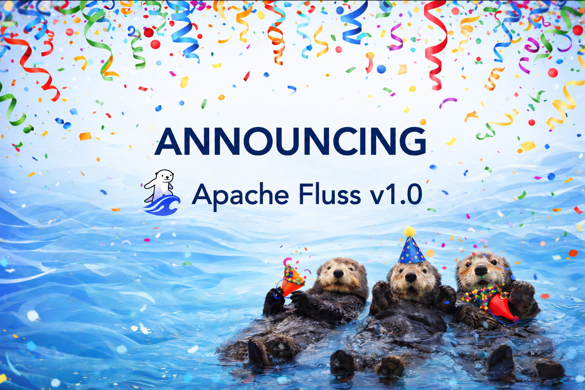
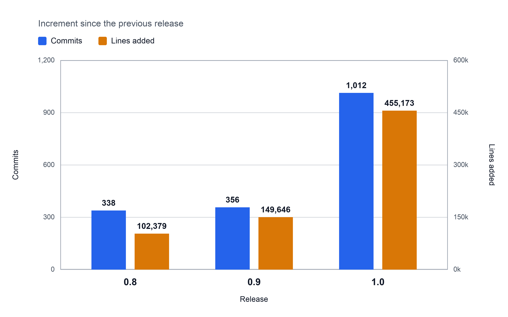
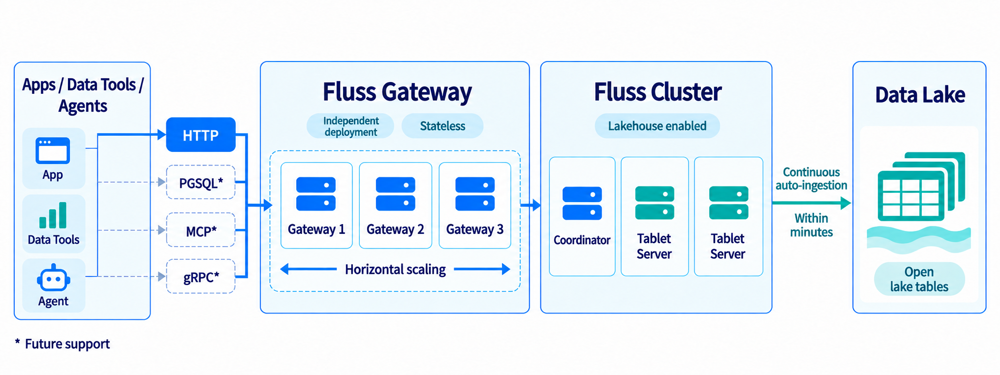
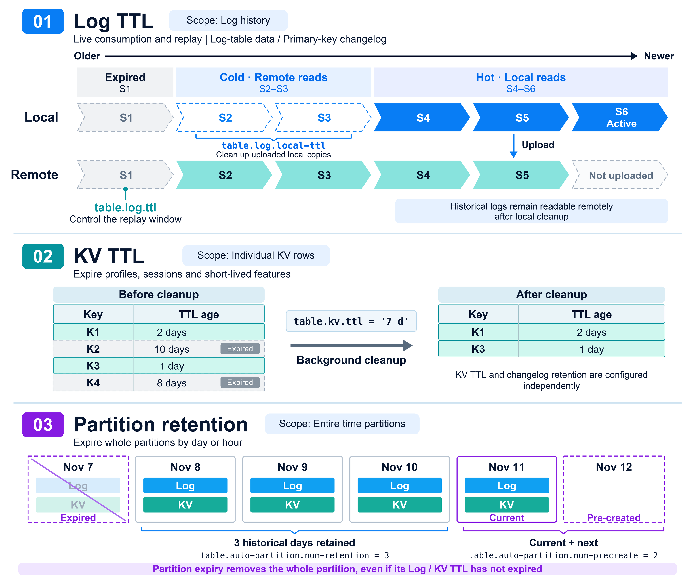
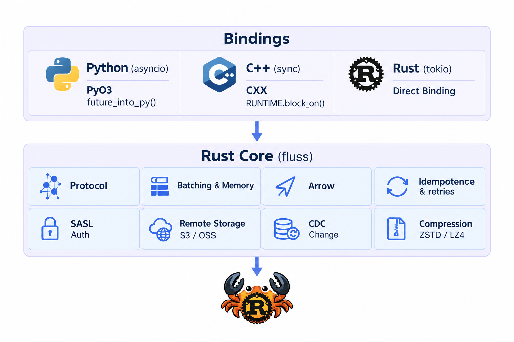
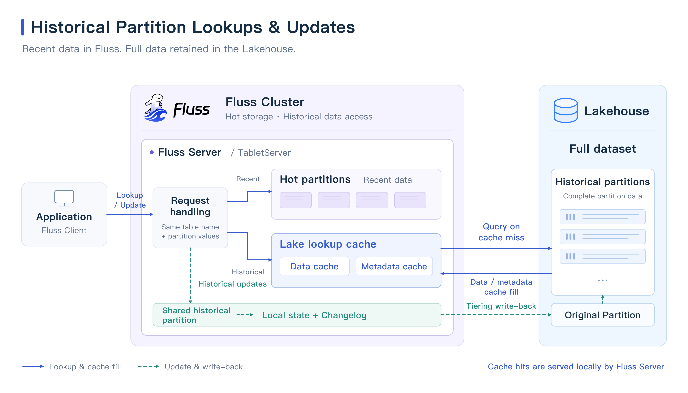

import ThemedImage from '@theme/ThemedImage';



🌊 We are excited to announce the official release of Apache Fluss 1.0!

AI agents and applications need data that keeps up with the world around them: current user profiles, recent interactions, changing business state, and fresh features for inference. Training pipelines also need access to historical data and newly arriving events. Fluss 1.0 strengthens the data layer connecting these workloads, from straightforward HTTP access for agents and native Python integration to continuous processing with Flink and training data preparation with Spark.

This is the first major release since [Fluss graduated from the Apache Incubator](https://fluss.apache.org/blog/apache-fluss-graduates-to-top-level-project/) to become a Top-Level Project. The community took a longer development cycle to prepare for this milestone. The release brings together **over a thousand commits** and **450,000 new lines of code**, roughly **three times** the amount added in previous releases. These numbers reflect the breadth of feature development, refinement, and validation, as well as the Fluss community's continued collaboration and active development.

<!-- truncate -->



## Fluss 1.0 Highlights

<ThemedImage
  alt="Fluss 1.0 features"
  sources={{
    light: require('../assets/1.0/features.png').default,
    dark: require('../assets/1.0/features-dark.png').default,
  }}
/>

- **New Gateway component**: A lightweight REST service written in Rust, giving agents and applications HTTP access to metadata, table management, and batch writes.
- **Native Python access to context and features**: Python AI applications can look up user profiles and feature values directly, alongside native Rust, C++ clients.
- **Storage for context and features**: More comprehensive TTL support, more efficient reads, and bucket rescaling help manage context state, feature data, and event histories as workloads grow.
- **Real-Time Lakehouse for Agents**: New Hudi support, plus lookups and updates for historical Paimon partitions, to accelerate agent access to historical data in the lakehouse.
- **Broader engine support**: Built-in Flink bitmap functions work seamlessly with Fluss RoaringBitmap aggregation tables; Spark adds batch Union Read and incremental reads over time windows.
- **More mature production operations**: Coordinator high availability, multiple local disks, resource protection, remote orphan file cleanup, and improvements to monitoring, security, and deployment.

## 1. Fluss Gateway: Lightweight, High-Performance Access for Agents and Applications



### HTTP Access to Fluss

Agents need a practical way to discover what data is available, understand its structure, and perform operations as part of a task. Fluss 1.0 introduces a Gateway component that translates REST requests into native Fluss client operations. This gives agents, web services, and automation a familiar HTTP entry point for working with Fluss, without requiring a native Fluss SDK in the calling application.

An agent equipped with HTTP tools can list available tables, inspect a table's schema, create a table for its output, and write back results or update application state. These operations let the agent interact directly with Fluss as part of its workflow. Event ingestion is one use of this interface, alongside metadata discovery and table management.

**The Gateway is written in Rust and reuses the Fluss Rust client core.** Native compilation and asynchronous request processing provide the foundation for high performance, while a compact binary distribution keeps deployment lightweight. The Gateway requires no JVM and can be deployed and scaled independently to match application traffic.

The Gateway is stateless, so multiple instances can serve requests behind a load balancer. Applications can use HTTP through the Gateway or access Fluss directly through native clients, while compute engines such as Flink and Spark continue to use their respective connectors. This provides flexible access options for different technology stacks.

For example, the following HTTP POST request writes an event to the `gateway_demo.events` log table:

```bash
curl -X POST \
  'https://gateway.example.com/v1/clusters/default/databases/gateway_demo/tables/events/records' \
  -H 'Content-Type: application/json' \
  -d '{
    "entries": [
      {"id": "event-1", "append": {"event_id": "1", "message": "created"}}
    ]
  }'
```

### Real-Time Ingestion over HTTP, Automatic Tiering to the Lakehouse

Fluss Gateway also provides a lightweight way to ingest real-time data into a data lake. When lakehouse support is enabled on a Fluss cluster, applications can send data to Fluss over HTTP in real time. Within a few minutes, the data is batched and written to the lakehouse, providing a minute-level latency lakehouse through simple HTTP writes.

### Toward MCP Access for Agents

Building on the HTTP interface available today, the community plans to add **Model Context Protocol (MCP)** support so that agents can interact with Fluss through a standard tool interface. The goal is to make changing business data, user context, and application state easier to access from agent workflows.

The broader plan also includes the **PostgreSQL wire protocol (PGSQL) and gRPC**, expanding the Gateway into a common access layer for applications, data tools, and agents.

Learn more: [Gateway Guide](https://fluss.apache.org/docs/1.0/gateway/), [Deploying the Gateway](https://fluss.apache.org/docs/1.0/install-deploy/deploying-gateway/), [Demo: A Real-Time Lakehouse over HTTP](https://fluss.apache.org/docs/1.0/quickstart/gateway-lakehouse/).

## 2. Storage for Real-Time Context and Features

### More Comprehensive TTL and Data Lifecycle Management

Data in real-time systems often has different retention requirements. Online consumers may need only a few hours of hot data, recovery or training pipelines may require several days of logs, and user profiles or session state may follow business-specific retention rules. Fluss 1.0 adds row-level TTL for primary key tables and an independent local log TTL, strengthens log retention management, and combines these with existing partition retention policies to manage data lifecycles at multiple levels.



**Log retention and local hot data retention can be configured independently.** `table.log.ttl` controls the log retention window and the new `table.log.local-ttl` allows a shorter window of hot data to remain on local disks, while older logs remain readable from remote storage. Both table options can be updated dynamically and take effect immediately. For low-traffic tables, active segment rolling allows logs to be uploaded and cleaned up even when there have been no new writes for an extended period.

**Rows in primary key tables can expire automatically.** The new `table.kv.ttl` sets a retention period based on business requirements and removes expired primary key records during compaction. It can be configured independently of the changelog retention window.

**For time-partitioned tables**, partition retention policies can still remove expired partitions as a whole. Logs and primary key records can expire before their partition does; a longer log or row-level TTL does not prevent an expired partition from being deleted. Data already tiered to the lake is managed by the lake's retention policies.

Learn more: [Data Retention and TTL](https://fluss.apache.org/docs/1.0/table-design/data-distribution/ttl/).

### Predicate Pushdown: Skipping Unnecessary Reads at the Storage Layer

Feature computation and training data preparation often need only a subset of an event stream, such as events for a particular device type or location. Fluss already supports column pruning to reduce the number of fields during streaming read. Version 1.0 goes further by pushing predicates down to the TabletServer storage layer. TabletServers use column statistics in each log batch to skip batches that cannot satisfy the predicate, avoiding both data transfer to the client and subsequent deserialization.

Once statistics are enabled for frequently filtered columns, Flink connectors and native clients that support pushdown can use this capability. For example, to enable statistics on an existing `sensor_events` table:

```sql
ALTER TABLE sensor_events SET (
    'table.statistics.columns' = 'temperature,location'
);
```

For a query with `temperature > 30 AND location = 'warehouse-A'`, the TabletServer only needs to inspect a small amount of metadata, such as minimum values, maximum values, and null counts, to determine whether a batch could contain matching records. This requires no decoding or row-by-row scanning of the actual data. The additional server CPU cost is therefore negligible, while unnecessary network traffic and client-side processing can be substantially reduced.

This optimization applies to Arrow-format log tables and only to data written after statistics are enabled. Statistics rule out batches that definitely cannot match. The client still applies row-level filtering to the remaining batches to ensure correct results.

Learn more: [Filter Pushdown](https://fluss.apache.org/docs/1.0/engine-flink/reads/#filter-pushdown).

### Bucket Rescaling: Adjusting Capacity for Future Partitions

The bucket count chosen when creating a daily partitioned table may not remain appropriate as workloads change. Fluss 1.0 allows the default bucket count of a partitioned table to be updated, so that partitions created afterward use the new layout:

```sql
ALTER TABLE daily_events SET ('bucket.num' = '8');
```

Existing partitions with `4` buckets keep their layout, while newly created partitions use `8`. Applications can gradually increase storage parallelism as new partitions are created, or reduce the bucket count for future partitions to lower the overhead of small partitions.

This change affects only partitions created afterward. It does not currently apply to non-partitioned tables, tables using the aggregation merge engine, or tables with historical partition access enabled. The relevant clients and connectors must be upgraded before enabling it.

Learn more: [Bucketing](https://fluss.apache.org/docs/1.0/table-design/data-distribution/bucketing/#rescaling-bucket-count-for-future-partitions).

### Streaming Full Scans of Primary Key Tables

Fluss 1.0 adds streaming full scans of primary key tables. TabletServers scan the current data in a primary key table directly and return it to the client in a sequence of small batches. This avoids the preparation step of downloading a snapshot to the client and merging subsequent changelog records.

For large primary key tables, clients can read, process, and release data incrementally. Each RPC transfers only a small batch of records, without loading the entire table into server or client memory. This bounds memory usage during scans and avoids out-of-memory errors caused by full-table reads. Java applications can use `table.newScan().createBatchScanner()`, and Flink batch queries can select `client.scanner.kv.batch-strategy = 'server-scan'`.

Learn more: [Server-Side Scans of Primary Key Tables](https://fluss.apache.org/docs/1.0/engine-flink/reads/#server-side-scan-of-primary-key-tables).

## 3. Native Clients for Rust, C++, Python, and Java

Fluss 1.0 is the first release in which the Rust, Python, and C++ clients are maintained in the main repository and released alongside the main project. Together with the Java client, they provide native access for applications across different technology stacks. Shared maintenance brings protocol changes, feature development, cross-language testing, and release schedules into closer alignment. Data science applications, native services, and Java data pipelines can all use Fluss directly in their preferred languages.

### One Rust Core, Multiple Language Interfaces

The Rust, Python, and C++ clients share a Rust core. This core handles connection management, protocol communication, metadata access, and data reads and writes. Python and C++ expose these capabilities through language bindings and their own APIs.



The shared core lets Python and C++ reuse protocol handling and read/write logic, reducing duplicate implementation work and making it easier to deliver core fixes and performance improvements across languages. Each language still provides idiomatic interfaces, allowing applications to work directly with asynchronous calls, dictionaries, or columnar data batches.

### Python AI Applications: Context Lookups and Batch Writes

Python AI applications can look up user profiles and features continuously updated by Flink, using the results for inference or agent context without a JVM. For an existing primary key table `features_table` keyed by `user_id`:

```python
lookuper = features_table.new_lookup().create_lookuper()
features = await lookuper.lookup({"user_id": 42})
```

Python data pipelines can also write processed events or training examples as PyArrow RecordBatches, avoiding row-by-row conversion. Given a log table `table` and a `record_batch` matching its schema:

```python
writer = table.new_append().create_writer()
writer.write_arrow_batch(record_batch)
await writer.flush()
```

### Java Multi-Table APIs and Batch Read Enhancements

The Java client adds multi-table scanners and writers. Through `connection.getMultiTable()`, a single pipeline can subscribe to multiple tables or route each record to its target table. This is useful for database-wide synchronization, CDC consolidation, and data replication for Fluss cluster. Scan results include the source table, schema, and change type, making it easier to process events from multiple tables consistently.

The Java Typed API extends its support for complex types, enums, and column name mappings. Native Arrow batch reads also provide more direct access for columnar processing applications.

Learn more: [Client Documentation](https://fluss.apache.org/docs/1.0/apis/), [Multi-Language Client Support Matrix](https://fluss.apache.org/docs/1.0/apis/client-support-matrix/), [Java Multi-Table API](https://fluss.apache.org/docs/1.0/apis/java/#multi-table-scanner-and-writer).

## 4. Lakestream: Connecting Real-Time Context with Historical Data

### Apache Hudi Integration

Fluss 1.0 extends Lakestream support to [Apache Hudi](https://hudi.apache.org/). Teams using Hudi can continuously tier Fluss data into lake tables while retaining low-latency access to the latest data in Fluss. Union Read combines historical and real-time data in a single query.

Primary key tables map to Hudi Merge-On-Read tables, while log tables map to Copy-On-Write tables. After deploying the Hudi plugin and its dependencies, configure the lake format and start the tiering service to connect to an existing Hudi environment:

```yaml
datalake.enabled: true
datalake.format: hudi
datalake.hudi.mode: dfs
datalake.hudi.catalog.path: hdfs:///warehouse/hudi
```

When creating a table, enable tiering with `table.datalake.enabled` and configure the update ordering field and other options required by Hudi. The integration supports DFS and Hive Metastore catalogs, giving Hudi users another way to connect real-time data with their data lake.

Learn more: [Hudi Integration Guide](https://fluss.apache.org/docs/1.0/streaming-lakehouse/datalake-formats/hudi/).

### Accelerating Lakehouse Context Lookups and Updates for Agents

An agent answering a question about an older, or an application enriching a user profile, may need business context that has already moved out of Fluss hot storage. Late events, status updates, and data corrections can also arrive after a partition has been removed. Version 1.0 introduces historical partition access, currently available with the Paimon lake format, so that this data can continue to serve real-time applications.

For partitions removed from Fluss but still retained in Paimon, primary key point lookups continue to run on the Fluss server. When the original hot partition no longer exists, the TabletServer queries the corresponding Paimon table directly. On the first access to the relevant data files, the server builds a local lake lookup cache in Fluss on demand. Subsequent point lookups can reuse this cache, reducing repeated remote reads and speeding up access.

Late writes and historical corrections also continue to go through Fluss. The client routes records to a shared historical partition, where Fluss maintains the corresponding local state and generates a changelog. The tiering service then writes the changes back to the original Paimon partition.



For eligible tables, enable the following option to read and write historical partitions using the original table name and partition values:

```sql
ALTER TABLE daily_orders SET (
    'table.datalake.historical-partition.enabled' = 'true'
);
```

This capability currently applies to Paimon-backed auto-partitioned tables with a single partition column. Historical partition lookups are available for primary key tables, while historical writes support both log and primary key tables. Historical partition access cannot currently be combined with bucket rescaling. After enabling it, existing lookup jobs must be restarted to load the configuration.

Learn more: [Historical Partition Read/Write](https://fluss.apache.org/docs/1.0/table-design/data-distribution/partitioning/#historical-partition-access).

### Lake Tables with Only Business Columns

Starting with 1.0, newly created Paimon and Iceberg lake tables no longer need the three additional Fluss system columns: `__bucket`, `__offset`, and `__timestamp`. Other compute engines, data tools, and users see a schema that more closely matches the business data. This reduces the need to handle internal columns when using lake tables across systems and avoids introducing Fluss-specific schema changes into existing lakehouse applications.

This change applies to newly created lake tables by default. Existing tables retain their original layout, and the new version client can read and write both layouts without migrating historical files.

Learn more: [Lake Table Schemas and Upgrade Compatibility](https://fluss.apache.org/docs/1.0/maintenance/operations/upgrade-notes-1.0/#lake-table-schema-changes-fip-27).

## 5. Engine Ecosystem: Richer Flink and Spark Integration

### Flink: From Real-Time Analytics to Batch Processing

#### Bitmap SQL Functions and Real-Time Distinct Counts

User profiling and personalization pipelines often need to understand which users interacted with a channel or belong to a particular audience. The aggregation merge engine introduced in 0.9 can maintain sets of distinct values in the Fluss storage layer. Version 1.0 adds Flink SQL functions for constructing RoaringBitmaps, performing set operations, and querying cardinality. These connect dictionary encoding, bitmap construction, storage-side aggregation, and analytical queries into a complete pipeline for real-time distinct counts and audience analysis. After switching to a Fluss catalog, the functions are available directly, without registering additional UDFs.

In the page user profile example below, `user_dict` maps high-cardinality email addresses to compact integer UIDs. `rb_build` creates a single-user bitmap for each visit, and the `rbm32` aggregation table continuously merges the bitmaps inside the TabletServer. The Flink job only handles mapping and forwarding, with no need to maintain state for distinct counts:

```sql
-- 1. Dictionary mapping: email -> INT uid
CREATE TABLE user_dict (
    email STRING,
    uid INT,
    PRIMARY KEY (email) NOT ENFORCED
) WITH ('auto-increment.fields' = 'uid');

-- 2. RBM aggregation table: continuously accumulate unique visitors by channel and hour
CREATE TABLE page_uv (
    channel STRING,
    hh STRING,
    uv_bitmap BYTES,
    PRIMARY KEY (channel, hh) NOT ENFORCED
) WITH (
    'table.merge-engine' = 'aggregation',
    'fields.uv_bitmap.agg' = 'rbm32'
);

-- 3. page_views is the real-time event source; new emails are added to the dictionary automatically
INSERT INTO page_uv
SELECT e.channel, e.hh, rb_build(ARRAY[d.uid])
FROM page_views AS e
JOIN user_dict
/*+ OPTIONS('lookup.insert-if-not-exists' = 'true') */
FOR SYSTEM_TIME AS OF e.proctime AS d
ON e.email = d.email;

-- 4. Aggregate across dimensions: merge bitmaps, then compute exact unique visitor counts
SELECT channel,
       rb_cardinality(rb_or_agg(uv_bitmap)) AS uv
FROM page_uv
GROUP BY channel;
```

This pipeline brings string dictionary encoding, exact distinct counts, and aggregation across time granularities into Flink SQL and Fluss. When the same user visits multiple times across different hours, the query merges the hourly bitmaps with `rb_or_agg` and uses `rb_cardinality` to compute the unique visitor count without double-counting.

Aggregation merge-engine tables also support partial updates and the addition of new aggregation columns in 1.0. Real-time metric and feature tables can evolve as applications need new signals, without rebuilding the entire table.

Learn more: [Demo: Real-Time User Profiles](https://fluss.apache.org/docs/1.0/quickstart/page_user_profile/), [Bitmap SQL Functions](https://fluss.apache.org/docs/1.0/engine-flink/sql-functions/), [Aggregation Merge Engine](https://fluss.apache.org/docs/1.0/table-design/merge-engines/aggregation/).

#### Flink Batch Processing Enhancements

Fluss 1.0 improves Flink batch processing. In batch mode, Flink SQL can read both Fluss log tables and primary key tables directly. The `$changelog` and `$binlog` virtual tables also support bounded reads. These capabilities provide inputs for training data preparation, feature backfills, offline analysis, exports, and auditing, using the event and change histories retained in Fluss.

Data maintenance for primary key tables is more flexible as well. In batch mode, `UPDATE` and `DELETE` no longer require the `WHERE` clause to specify the full primary key. Instead, they can scan and modify matching rows based on other business columns:

```sql
SET 'execution.runtime-mode' = 'batch';

UPDATE user_profiles
SET email = NULL
WHERE consent_status = 'revoked';

DELETE FROM user_profiles
WHERE erasure_requested = TRUE;
```

This is particularly useful for data compliance workflows, such as those related to GDPR. Users can anonymize sensitive information or erase personal data in bulk based on non-primary-key columns.

Learn more: [Flink Batch Reads](https://fluss.apache.org/docs/1.0/engine-flink/reads/), [Flink UPDATE and DELETE](https://fluss.apache.org/docs/1.0/engine-flink/writes/).

#### Improved Reads and Stream Processing

The Flink connector integrates storage-layer predicate pushdown and streaming full KV scans. It also adds projection and filter pushdown for the `$changelog` and `$binlog` virtual tables to reduce unnecessary reads.

This release supports the newly released Flink 2.3 and improves watermark pushdown, watermark DDL, lookup shuffle, and bounded stream reads, helping Fluss fit more naturally into existing Flink SQL jobs.

Learn more: [Flink Integration](https://fluss.apache.org/docs/1.0/engine-flink/getting-started/).

### Spark: Analyzing Real-Time and Historical Data Together

#### Union Read Support

Spark now supports batch Union Read for both log and primary key tables. For Fluss tables with `table.datalake.enabled` enabled, the connector automatically combines the latest data in Fluss hot storage with historical data in the lake, providing a complete view across both tiers:

```sql
SELECT SUM(total_price) AS total_revenue
FROM fluss_order_with_lake;
```

Existing Spark batch, exploration, and analytical jobs can access the complete dataset through a single Fluss table, without manually combining query results from the hot and cold tiers. For AI pipelines, this provides a source for preparing training examples from historical records together with recent interactions, feedback, and corrections.

#### Incremental Reads over Time Windows

For periodic processing and feature updates, Spark can read only the changes within a specified commit-time window, avoiding a full-table scan on every run. Once the Fluss Spark session extension is configured, the following query can be run directly:

```sql
SELECT * FROM fluss_incremental_between_timestamp(
    'fluss_catalog.fluss.orders',
    '2026-09-14 00:00:00',
    '2026-09-15 00:00:00'
);
```

The window is a half-open interval, `[start, end)`. Log tables return records appended within the window. Primary key tables return the latest valid value as of the end of the window for each key that changed during it. Delete events are not returned in the results.

The Spark integration also adds or improves:

- Filter, partition, projection, and LIMIT pushdown to reduce unnecessary scans.
- `MAP` support in Spark type mappings.
- Builds for both Scala 2.12 and Scala 2.13.

Learn more: [Spark Reads](https://fluss.apache.org/docs/1.0/engine-spark/reads/), [Structured Streaming](https://fluss.apache.org/docs/1.0/engine-spark/structured-streaming/), [Union Read](https://fluss.apache.org/docs/1.0/streaming-lakehouse/union-read/), [Time-Range Incremental Reads](https://fluss.apache.org/docs/1.0/engine-spark/reads/#time-range-batch-read).

## 6. Production Clusters Built for Continuous Operation

### Coordinator High Availability

Fluss 1.0 adds Coordinator high availability. When multiple Coordinators are deployed in the same cluster, one acts as the leader and the others remain on standby. If the leader fails, a standby immediately takes over metadata management and recovery coordination.

This reduces the management service's dependence on a single process. During rolling upgrades, Coordinators can be upgraded one at a time, keeping operations such as table management available while an individual Coordinator restarts.

Learn more: [Coordinator HA Deployment](https://fluss.apache.org/docs/1.0/install-deploy/deploying-distributed-cluster/#fluss-coordinatorserver-high-availability-ha-setup).

### Multiple Local Disks

Fluss 1.0 supports configuring multiple local data directories for a TabletServer through `data.dirs`, distributing logs and KV data across several disks. When creating a new replica, the TabletServer chooses a disk with a lower load. This reduces the risk of a single disk becoming a capacity or I/O bottleneck and makes it easier to expand storage on a node.

```yaml
# Spread local data across multiple disks
data.dirs: /mnt/disk1/fluss,/mnt/disk2/fluss,/mnt/disk3/fluss
```

Learn more: [Cluster Configuration](https://fluss.apache.org/docs/1.0/maintenance/configuration/).

### Staying Available Under Pressure

Fluss 1.0 adds several layers of resource protection to help clusters remain available under disk, memory, or request pressure, including overload and uneven traffic distribution:

- **Data disk protection**: Once disk usage reaches a configurable high watermark, new client writes are rejected with a retriable error. Writes resume automatically when usage falls below the recovery threshold.
- **KV write backpressure**: Write throughput is throttled when RocksDB Level-0 files accumulate faster than compaction can process them.
- **KV capacity admission control**: The creation of new primary key table or partition replicas is limited before RocksDB instances consume too much TabletServer memory.
- **Lifecycle operation throttling**: Large bursts of table deletions are prevented from overwhelming the Coordinator event queue.

These protections can be configured independently, allowing operators to set thresholds based on cluster size and workload characteristics.

Learn more: [Resource Protection](https://fluss.apache.org/docs/1.0/maintenance/operations/resource-protection/).

### Cluster Health Checks for More Reliable Rolling Upgrades

Fluss 1.0 introduces `Admin.getClusterHealth()`, which checks active leaders and in-sync replicas to determine whether a cluster has recovered. Its primary purpose is to support graceful rolling upgrades. After each TabletServer restart, the upgrade process waits for the cluster to return to a Ready state before proceeding to the next node. This avoids restarting additional nodes while leader elections or replica catch-up are still in progress, reducing the risk of multiple unrecovered nodes, insufficient in-sync replicas (ISR), and temporary data unavailability.

Learn more: [Rolling Upgrades and Cluster Health Checks](https://fluss.apache.org/docs/1.0/maintenance/operations/upgrading/#wait-for-the-cluster-to-recover-before-upgrading-the-next-tabletserver), [Helm Cluster Health Readiness Probe](https://fluss.apache.org/docs/1.0/install-deploy/deploying-with-helm/#cluster-health-readiness-probe).

### Remote Orphan File Cleanup

Over time, failed uploads or incomplete deletions can leave unreferenced files in a cluster's remote storage. Fluss 1.0 provides the `remove_orphan_files` maintenance action to remove eligible orphan files and help control remote storage usage.

The tool runs as a Flink batch job, can be scoped to specific databases and tables, and selects files based on references and retention periods. Use `--dry-run` to inspect candidate files and cleanup logs before performing the deletion. Cleanup covers Fluss's own remote storage and excludes lake table data. It can be incorporated into routine storage maintenance.

Learn more: [Remote Orphan File Cleanup](https://fluss.apache.org/docs/1.0/engine-flink/actions/#remove_orphan_files).

### Production-Ready Helm Deployments

The Helm chart now supports SASL authentication for Fluss and ZooKeeper, existing Kubernetes Secrets, external secret providers, scheduling controls, extra volumes, init containers, pod annotations and labels, and PodDisruptionBudgets. These options make it easier to fit Fluss into established Kubernetes security, scheduling, and availability practices.

Learn more: [Deploying with Helm](https://fluss.apache.org/docs/1.0/install-deploy/deploying-with-helm/).

### Clearer Monitoring and Security Management

Version 1.0 adds and improves lake tiering metrics such as `pendingRecords` and `pendingRecordsLag`, which report the number of records still waiting to be tiered and the tiering delay, respectively. The `freshness` metric exposes the target freshness for each table. Monitoring `pendingRecordsLag > freshness` helps operators detect cases where the tiering service is still running but the lake data has fallen behind.

For security management, Fluss now supports centralized management of multiple SASL/PLAIN users. Administrators maintain users through the dynamic `security.sasl.plain.credentials` configuration, use `sys.append_cluster_configs` to add users or update passwords, and use `sys.subtract_cluster_configs` to remove users, all without restarting the cluster. Clients set `client.security.protocol` to `SASL` and `client.security.sasl.mechanism` to `PLAIN`, then authenticate with `client.security.sasl.username` and `client.security.sasl.password`.

Learn more: [Monitoring Metrics](https://fluss.apache.org/docs/1.0/maintenance/observability/monitor-metrics/), [Authentication](https://fluss.apache.org/docs/1.0/security/authentication/), [Credential Management](https://fluss.apache.org/docs/1.0/security/secrets/).

## More Improvements and Upgrade Notes

Fluss 1.0 also adds a Tencent Cloud COS filesystem, improves support for cloud storage credentials, adds an InfluxDB metrics reporter, and continues to improve read and write stability in both clients and servers. For the full list of changes, see the [1.0 milestone](https://github.com/apache/fluss/milestone/6?closed=1). Before upgrading from 0.9, read the [1.0 Upgrade Notes](https://fluss.apache.org/docs/1.0/maintenance/operations/upgrade-notes-1.0/).

## Getting Started and Community Acknowledgments

As the first major release since Fluss graduated from the Apache Incubator, Fluss 1.0 brings a more complete feature set and more stable, mature APIs for large-scale production deployments. For teams building AI applications, it connects the flow from incoming events to real-time context and features, and from historical data to training examples: interact with Fluss through the Gateway or Python clients, process with Flink, and prepare datasets with Spark and the lakehouse.

Get the release from the [Downloads page](https://fluss.apache.org/downloads/) and try the new capabilities with the [Quickstart](https://fluss.apache.org/docs/1.0/quickstart/flink/) and the [Gateway Real-Time Lakehouse Demo](https://fluss.apache.org/docs/1.0/quickstart/gateway-lakehouse/).

Fluss 1.0 would not have been possible without the community. Thank you to the more than one hundred contributors below who participated in development, issue reporting, reviews, testing, documentation, and production validation:

> AlexZhao, Andrea Bozzo, Anton Borisov, Arnav-Panjla, Arnav\_Panjla, Aryamaan Singh, Beetle brank, CaoZhen, Chase Naples, Daeuk Choi, Dream95, Evan, Femi, ForwardXu, Gabriel Baldez, George Stamatakis, Gezi-lzq, Giannis Polyzos, Giovanny Gutiérrez, GuoYu, Hemanth Savasere, Hongshun Wang, Howie Wang, JB Onofré, Jackeyzhe, Jared Yu, Jared Yu (余启正), Jark Wu, Junbo Wang, Junfan Zhang, Kaiqi Dong, Kaixuan Duan, Karan Pradhan, Keith Lee, Kelvin Wu, Leonard Xu, Liebing, Liurnly, Lorenzo Affetti, Madhur Chandran, Mahesh Sambaram, MehulBatra, Miao, Michael Koepf, Mitchell, Muhammet Orazov, NekoPunch, Nicoleta Lazar, Nikhil Negi, Pavlos-Petros Tournaris, Pei Yu, Pengcheng Huang, Prajwal Banakar, Prajwal banakar, Pranav Shukla, QuakeWang, Shawn Huang, SkylerLin, Thorne, Tom, Trevin Chow, Uğur Tafralı, Vaibhav, Vladyslav Banar, XiaoHongbo, Xiaobing Fang, Xuyang, Yang Guo, Yang Wang, Yang Zhang, Yann Byron, aicontentcreate2023-star, bryndenZh, charlesdong1991, dependabot\[bot\], duankaixuan, fhan, fluxo, hanliu0830, hemanthsavasere, ipolyzos, kaiwangleo, leon.jeon, litiliu, luoyuxia, naivedogger, nhuan.bc, nhuantho, pbanakar, seokjin0414, slfan1989, striver619, tison, vaibhavk1992, vamossagar12, vbhanuchander-lang, warmbupt, whenzhou.zc, xiaozhou, xx789, yunhong, yuxia, yuxia Luo, zhengyunhong.zyh, zhigang, 白鵺.

Apache Fluss is under active development. Be sure to stay updated on the project, give it a try and if you like it, don’t forget to give it some ❤️ via ⭐ on [GitHub](https://github.com/apache/fluss).
